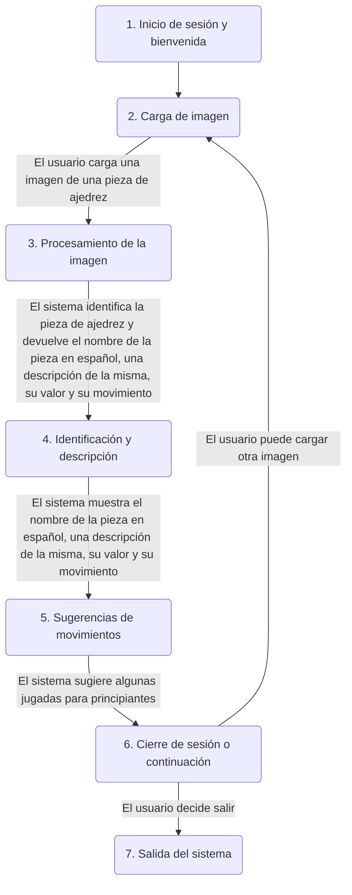

# Sistema Identificador de Piezas de Ajedrez

2024-05-07 18:45:03

## Descripción del problema

El ajedrez es un juego de mesa para dos jugadores que se juega en un tablero de 64 casillas. Cada jugador comienza con 16 piezas: un rey, una reina, dos torres, dos alfiles, dos caballos y ocho peones. El objetivo del juego es dar jaque mate al rey del oponente.

Primero, uno de las primeras dificultades a las que se enfrentan quienes inician en este deporte es identificar cuáles son las piezas.

Por esta razón, se necesita un sistema que permita identificar el nombre de cada pieza.

Segundo, el ajedrez es un juego que requiere de mucha práctica y estudio para poder dominarlo. Una de las primeras cosas que se aprenden son los movimientos de las piezas. Por lo tanto, sería de gran ayuda que el sistema también pudiera mostrar el movimiento de cada pieza.

Tercero, cada pieza tiene un valor diferente. Por ejemplo, el rey tiene un valor de 0, la reina 9, la torre 5, el alfil 3, el caballo 3 y el peón 1. Sería de gran ayuda que el sistema también pudiera mostrar el valor de cada pieza.

Por último, sería de gran ayuda que el sistema también pudiera sugerir algunas jugadas para principiantes que le ayuden a aprender de cada pieza y del juego en general.

## Descripción de la solución


El SIPA (Sistema Identificador de Piezas de Ajedrez) es un programa que permite:

1) Identificar el nombre de una pieza de ajedrez a partir de una imagen.
2) Mostrar una descripción de la pieza.
3) Mostrar el valor de la pieza.
4) Mostrar el movimiento de la pieza.
5) Sugerir algunas jugadas para principiantes.

Las piezas de ajedrez que se pueden identificar son las siguientes:

- Rey
- Reina
- Alfil
- Caballo
- Torre
- Peón

El SIPA debe ser capaz de identificar las piezas por medio del reconocimiento de imágenes, es decir, el usuario deberá cargar una imagen de la pieza de ajedrez y el sistema le devolverá el nombre de la pieza, acompañado de una descripción de la misma, su valor y su movimiento. Y algunos ejemplos de imágenes de la misma pieza de ajedrez de distintos modelos, formas y colores.

## Proceso

El siguiente proceso, hecho en mermaid, describe el flujo de interacción entre el usuario y el sistema:



### Storyboard

A continuation se muestra un storyboard que describe el flujo de interacción entre el usuario y el sistema:


1. **Inicio de sesión y bienvenida:**
   - **Escena**: El usuario abre la aplicación SIPA en página web.
   - **Acción**: Se muestra una pantalla de bienvenida con opciones para iniciar sesión o registrarse.

2. **Carga de imagen:**
   - **Escena**: El usuario selecciona la opción para identificar una pieza de ajedrez.
   - **Acción**: Se le solicita que tome una foto de una pieza de ajedrez o cargue una imagen desde su galería.

3. **Procesamiento de la imagen:**
   - **Escena**: La imagen se sube y el sistema comienza a analizarla.
   - **Acción**: Se utiliza tecnología de reconocimiento de imágenes para identificar qué pieza de ajedrez es.

4. **Identificación y descripción:**
   - **Escena**: La aplicación muestra el resultado del análisis.
   - **Acción**: Se muestra el nombre de la pieza (por ejemplo, "Reina"), junto con una descripción detallada de sus movimientos y su valor en el juego.

5. **Sugerencias de movimientos:**
   - **Escena**: Junto con la descripción, se ofrecen sugerencias de estrategias con esa pieza como protagonista.
   - **Acción**: Se visualizan secuencias y estrategias recomendadas.

6. **Cierre de sesión o continuación:**
   - **Escena**: Tras interactuar con la información de la pieza, el usuario decide si cerrar la sesión o seguir explorando.
   - **Acción**: El usuario cierra la sesión o vuelve al inicio para cargar una nueva imagen.

## Working Backwards

El enfoque "Working Backwards" consta de 3 pasos, a continuación se podrá encontrar cada uno de ellos.

[Comunicado de prensa.](press_release.md)

[Cinco preguntas centradas en el cliente.](5_questions.md)

[Preguntas Frecuentes (FAQ).](faq.md)

## La solución

Para ingresar al sistema, pueden hacerlo en la siguiente dirección:

[https://sipa.com](https://sipa.com)


## Arquitectura de la solución


### Componentes  CRISP-DM / Well Architected Machine Learning Lens

- Adquisición de datos
  - Se lleva a cabo por medio de la carga de imágenes de piezas de ajedrez.
- ETLs a la nube
  - Se realiza el procesamiento de las imágenes en la nube.
- Preprocesamiento de datos (tabluar, texto o imágenes)
  - SageMaker para identificar el nombre de la pieza. Con un modelo de Deep Learning.
- Analítica de datos y/o entrenamiento de un modelo de Machine Learning o ajuste de un modelo Estadístico.
  - Notebook en SageMaker para entrenar el modelo y ponerlo en producción.
- Inferencia de resultados en caso de modelos predictivos.
  - Devuelve el etiquetado de la pieza de ajedrez.
  - Devuelve la descripción de la pieza.
  - Devuelve el valor de la pieza.
  - Devuelve el movimiento de la pieza.
  - Devuelve sugerencias de movimientos.
  - Devuelve ejemplos de imágenes de la misma pieza de ajedrez de distintos modelos, formas y colores.
- Despliegue
  - Realtime endpoint en SageMaker para la inferencia.
  - API Gateway para consumir el modelo.
  - Lambda para ejecutar el modelo.
  - S3 para almacenar las imágenes.
  - CloudWatch para monitorear el sistema.
  - IAM para gestionar los permisos.
- Mecanismo para consumir el producto de datos.
  - Interfaces web para cargar las imágenes y visualizar los resultados.

## Presentación ejecutiva

- Problema u oportunidad.
- Usuario final y beneficio principal
- Producto de datos y Working Backwards
- Arquitectura
- Datos
- Demo

## Estructura del Repo

```plaintext
.
├── README.md
├── img
│   ├── banner.png
│   ├── arch.png
│   └── storyboard.png
|     └── imagen_QR
├── press_release.md
├── 5_questions.md
├── faq.md

```

## Referencias

- Las imágenes usadas para el entrenamiento provienen de [Chessman image dataset de Kaggle](https://www.kaggle.com/niteshfre/chessman-image-dataset) y pueden descargase [aquí](https://www.kaggle.com/datasets/niteshfre/chessman-image-dataset?resource=download)
- [EnthuZiastic](https://enthu.com/blog/chess/why-is-chess-so-hard/)
- [ChessBase](https://en.chessbase.com/post/five-problems-most-new-chess-players-face)
- [Aperturas de ajedrez](https://chess-site.com/articles/chess-openings/)
- [Chess.com](https://www.chess.com/learn-how-to-play-chess)
- Diagramas de flujos con [mermaid.live](https://mermaid.live/)
