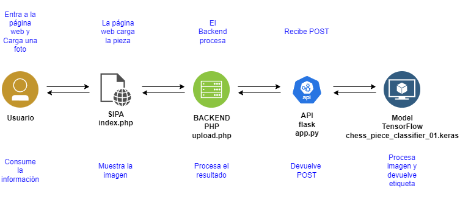
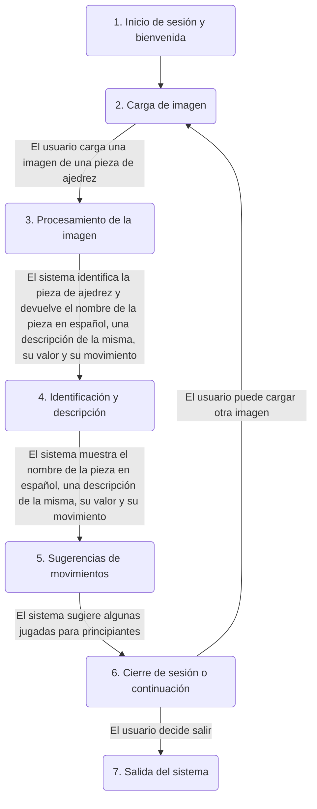

# Sistema Identificador de Piezas de Ajedrez

2024-05-07 18:45:03

## Tabla de Contenido

- [Sistema Identificador de Piezas de Ajedrez](#sistema-identificador-de-piezas-de-ajedrez)
  - [Tabla de Contenido](#tabla-de-contenido)
  - [Equipo](#equipo)
  - [Presentación ejecutiva](#presentación-ejecutiva)
    - [Descripción del problema u oportunidad.](#descripción-del-problema-u-oportunidad)
    - [Descripción de la solución](#descripción-de-la-solución)
    - [Usuario Final y su beneficio principal con el producto de datos](#usuario-final-y-su-beneficio-principal-con-el-producto-de-datos)
    - [Arquitectura de la solución](#arquitectura-de-la-solución)
    - [Datos Utilizados](#datos-utilizados)
    - [Demo de la Solución](#demo-de-la-solución)
  - [Proceso](#proceso)
    - [Storyboard](#storyboard)
  - [Working Backwards](#working-backwards)
  - [La solución](#la-solución)
    - [Componentes  CRISP-DM / Well Architected Machine Learning Lens](#componentes--crisp-dm--well-architected-machine-learning-lens)
  - [Modelo de Deep Learning](#modelo-de-deep-learning)
  - [Arquitectura de Red Neuronal](#arquitectura-de-red-neuronal)
  - [Presentación ejecutiva](#presentación-ejecutiva-1)
  - [Estructura del Repo](#estructura-del-repo)
  - [Referencias](#referencias)

## Equipo

Este trabajo fue realizado por:

|Nombre|Matrícula|Correo
|-|-|-
|Horus Ordoñez Bello|214481|horus.act@gmail.com
|Javier Castillo Millán|169589|rardeva@yahoo.com

## Presentación ejecutiva

- Descripción del Problema u oportunidad.
- Descripción de la solución.
- Usuario Final y su beneficio principal con el producto de datos
- Arquitectura de la solución
- Datos Uyilizados
- Demo de la Solución

### Descripción del problema u oportunidad.

El ajedrez es un juego de mesa para dos jugadores que se juega en un tablero de 64 casillas. Cada jugador comienza con 16 piezas: un rey, una reina, dos torres, dos alfiles, dos caballos y ocho peones. El objetivo del juego es dar jaque mate al rey del oponente.

Primero, uno de las primeras dificultades a las que se enfrentan quienes inician en este deporte es identificar cuáles son las piezas.

Por esta razón, se necesita un sistema que permita identificar el nombre de cada pieza.

Segundo, el ajedrez es un juego que requiere de mucha práctica y estudio para poder dominarlo. Una de las primeras cosas que se aprenden son los movimientos de las piezas. Por lo tanto, sería de gran ayuda que el sistema también pudiera mostrar el movimiento de cada pieza.

Tercero, cada pieza tiene un valor diferente. Por ejemplo, el rey tiene un valor de 0, la reina 9, la torre 5, el alfil 3, el caballo 3 y el peón 1. Sería de gran ayuda que el sistema también pudiera mostrar el valor de cada pieza.

Por último, sería de gran ayuda que el sistema también pudiera sugerir algunas jugadas para principiantes que le ayuden a aprender de cada pieza y del juego en general.


### Descripción de la solución


El SIPA (Sistema Identificador de Piezas de Ajedrez) es un programa que permite:

1) Identificar el nombre de una pieza de ajedrez a partir de una imagen.
2) Mostrar una descripción de la pieza.
3) Mostrar el valor de la pieza.
4) Mostrar el movimiento de la pieza.
5) Sugerir algunas jugadas para principiantes.

Las piezas de ajedrez que se pueden identificar son las siguientes:

- Rey
- Reina
- Alfil
- Caballo
- Torre
- Peón

El SIPA debe ser capaz de identificar las piezas por medio del reconocimiento de imágenes, es decir, el usuario deberá cargar una imagen de la pieza de ajedrez y el sistema le devolverá el nombre de la pieza, acompañado de una descripción de la misma, su valor y su movimiento. Y algunos ejemplos de imágenes de la misma pieza de ajedrez de distintos modelos, formas y colores.

### Usuario Final y su beneficio principal con el producto de datos

¿Quién es el cliente?
El cliente principal del Sistema Identificador de Piezas de Ajedrez (SIPA) incluye a entusiastas del ajedrez que desean profundizar su conocimiento sobre el juego, principiantes que buscan familiarizarse con las piezas y sus movimientos, jugadores que desean mejorar su estrategia, y educadores que desean enseñar ajedrez de una manera más interactiva y tecnológica.

¿Cuál es el problema del cliente o cuál es la oportunidad?
El problema radica en la curva de aprendizaje inicial del ajedrez, que puede ser intimidante debido a la complejidad de las reglas de movimiento y la estrategia de las piezas. La oportunidad es ofrecer una herramienta que facilite este aprendizaje inicial y proporcione una forma accesible y eficiente para que los principiantes y jugadores de todos los niveles entiendan y mejoren en el juego.
¿Cuál es el beneficio más importante del cliente?

¿Cuál es el beneficio?
El beneficio más importante es la reducción de la barrera de entrada para aprender y disfrutar del ajedrez. Al proporcionar un medio para identificar rápidamente las piezas y entender sus movimientos y estrategias asociadas, el SIPA fomenta una mayor participación y disfrute del juego, haciendo que los principiantes se sientan más cómodos y confiados.

### Arquitectura de la solución



### Datos Utilizados

Descripción de los datos...

### Demo de la Solución

Descripción de los datos...

## Proceso

El siguiente proceso, hecho en mermaid, describe el flujo de interacción entre el usuario y el sistema:



### Storyboard

A continuation se muestra un storyboard que describe el flujo de interacción entre el usuario y el sistema:


1. **Inicio de sesión y bienvenida:**
   - **Escena**: El usuario abre la aplicación SIPA en página web.
   - **Acción**: Se muestra una pantalla de bienvenida con opciones para iniciar sesión o registrarse.

2. **Carga de imagen:**
   - **Escena**: El usuario selecciona la opción para identificar una pieza de ajedrez.
   - **Acción**: Se le solicita que tome una foto de una pieza de ajedrez o cargue una imagen desde su galería.

3. **Procesamiento de la imagen:**
   - **Escena**: La imagen se sube y el sistema comienza a analizarla.
   - **Acción**: Se utiliza tecnología de reconocimiento de imágenes para identificar qué pieza de ajedrez es.

4. **Identificación y descripción:**
   - **Escena**: La aplicación muestra el resultado del análisis.
   - **Acción**: Se muestra el nombre de la pieza (por ejemplo, "Reina"), junto con una descripción detallada de sus movimientos y su valor en el juego.

5. **Sugerencias de movimientos:**
   - **Escena**: Junto con la descripción, se ofrecen sugerencias de estrategias con esa pieza como protagonista.
   - **Acción**: Se visualizan secuencias y estrategias recomendadas.

6. **Cierre de sesión o continuación:**
   - **Escena**: Tras interactuar con la información de la pieza, el usuario decide si cerrar la sesión o seguir explorando.
   - **Acción**: El usuario cierra la sesión o vuelve al inicio para cargar una nueva imagen.

## Working Backwards

El enfoque "Working Backwards" consta de 3 pasos, a continuación se podrá encontrar cada uno de ellos.

[Comunicado de prensa.](press_release.md)

[Cinco preguntas centradas en el cliente.](5_questions.md)

[Preguntas Frecuentes (FAQ).](faq.md)

## La solución

Para ingresar al sistema, pueden hacerlo en la siguiente dirección:

[http://3.89.113.93/index.php?piece=Queen](http://3.89.113.93/index.php?piece=Queen)


### Componentes  CRISP-DM / Well Architected Machine Learning Lens

- **Adquisición de datos**
  - Se lleva a cabo por medio de la carga de imágenes de piezas de ajedrez.
  - Esto es a través de la página web en la cual el usuario puede cargar la imagen.
  - La imagen es cargada en el servidor y se envía al modelo por medio de una API.
- **ETLs a la nube**
  - Se realiza el procesamiento de las imágenes en la nube.
  - Esto se lleva a cabo gracias a una API.
- **Preprocesamiento de datos**
  - Se hace una conversión de la imagen hacia un vector para enviar por medio de la API al modelo.
  - SageMaker para identificar el nombre de la pieza. Con un modelo de Deep Learning.
- **Analítica de datos y/o entrenamiento de un modelo de Machine Learning o ajuste de un modelo Estadístico**
  - Notebook en SageMaker para entrenar el modelo y ponerlo en producción.
- **Inferencia de resultados en caso de modelos predictivos**
  - Se lleva a cabo por medio de un modelo que fue creado en Jupyter.
  - Este modelo realizad transfer learning para usar una red neuronal preentrenada.
  - Esta red acelera el entrenamiento y mejora la precisión.
- **Despliegue**
  - Realtime endpoint en SageMaker para la inferencia.
  - API Gateway para consumir el modelo.
  - Lambda para ejecutar el modelo.
  - S3 para almacenar las imágenes.
  - CloudWatch para monitorear el sistema.
  - IAM para gestionar los permisos.
- **Mecanismo para consumir el producto de datos**
  - Interfaces web para cargar las imágenes y visualizar los resultados.

## Modelo de Deep Learning

El modelo de Deep Learning utilizado para el reconocimiento de imágenes es un modelo de transfer learning basado en la arquitectura VGG16. Este modelo fue entrenado con un dataset de imágenes de piezas de ajedrez y es capaz de identificar las 6 piezas de ajedrez.

Puede consultarse en este vínculo: [chess-pieces-image-classifier.ipynb](../src/chess-pieces-image-classifier.ipynb)

## Arquitectura de Red Neuronal

La arquitectura de la red neuronal utilizada para el reconocimiento de imágenes es la siguiente:

```plaintext
Model: "model"
_________________________________________________________________
 Layer (type)                Output Shape              Param #   
=================================================================
 input_1 (InputLayer)        [(None, 224, 224, 3)]     0         
                                                                 
 block1_conv1 (Conv2D)       (None, 224, 224, 64)      1792      
                                                                 
 block1_conv2 (Conv2D)       (None, 224, 224, 64)      36928     
                                                                 
 block1_pool (MaxPooling2D)  (None, 112, 112, 64)      0         
                                                                 
 block2_conv1 (Conv2D)       (None, 112, 112, 128)     73856     
                                                                 
 block2_conv2 (Conv2D)       (None, 112, 112, 128)     147584    
                                                                 
 block2_pool (MaxPooling2D)  (None, 56, 56, 128)       0         
                                                                 
 block3_conv1 (Conv2D)       (None, 56, 56, 256)       295168    
                                                                 
 block3_conv2 (Conv2D)       (None, 56, 56, 256)       590080    
                                                                 
 block3_conv3 (Conv2D)       (None, 56, 56, 256)       590080    
                                                                 
 block3_pool (MaxPooling2D)  (None, 28, 28, 256)       0         
                                                                 
 block4_conv1 (Conv2D)       (None, 28, 28, 512)       1180160   
                                                                 
 block4_conv2 (Conv2D)       (None, 28, 28, 512)       2359808   
                                                                 
 block4_conv3 (Conv2D)       (None, 28, 28, 512)       2359808   
                                                                 
 block4_pool (MaxPooling2D)  (None, 14, 14, 512)       0         
                                                                 
 block5_conv1 (Conv2D)       (None, 14, 14, 512)       2359808   
                                                                 
 block5_conv2 (Conv2D)       (None, 14, 14, 512)       2359808   
                                                                 
 block5_conv3 (Conv2D)       (None, 14, 14, 512)       2359808   
                                                                 
 block5_pool (MaxPooling2D)  (None, 7, 7, 512)         0         
                                                                 
 flatten (Flatten)           (None, 25088)             0         
                                                                 
 dense (Dense)               (None, 512)               12845568  
                                                                 
 dropout (Dropout)           (None, 512)               0         
                                                                 
 dense_1 (Dense)             (None, 128)               65664     
                                                                 
 dropout_1 (Dropout)         (None, 128)               0         
                                                                 
 dense_2 (Dense)             (None, 6)                 774       
                                                                 
=================================================================
Total params: 27626694 (105.39 MB)
Trainable params: 12912006 (49.26 MB)
Non-trainable params: 14714688 (56.13 MB)
_________________________________________________________________
```

## Presentación ejecutiva

- Problema u oportunidad.
- Usuario final y beneficio principal
- Producto de datos y Working Backwards
- Arquitectura
- Datos
- Demo

## Estructura del Repo

```plaintext
.
├── README.md
├── img
│   ├── banner.png
│   ├── arch.png
│   └── storyboard.png
|     └── imagen_QR
├── press_release.md
├── 5_questions.md
├── faq.md

```

## Referencias

- Las imágenes usadas para el entrenamiento provienen de [Chessman image dataset de Kaggle](https://www.kaggle.com/niteshfre/chessman-image-dataset) y pueden descargase [aquí](https://www.kaggle.com/datasets/niteshfre/chessman-image-dataset?resource=download)
- [EnthuZiastic](https://enthu.com/blog/chess/why-is-chess-so-hard/)
- [ChessBase](https://en.chessbase.com/post/five-problems-most-new-chess-players-face)
- [Aperturas de ajedrez](https://chess-site.com/articles/chess-openings/)
- [Chess.com](https://www.chess.com/learn-how-to-play-chess)
- Diagramas de flujos con [mermaid.live](https://mermaid.live/)
- [Chess Piece Classifier](https://github.com/DenverCoder1/chess-piece-classifier?)
- [Image classification with TensorFlow Lite Model Maker](https://www.tensorflow.org/lite/models/modify/model_maker/image_classification)
- [Chess Pieces Image Classifier| VGG16 | KFold ♟️](https://www.kaggle.com/code/amankumar234/chess-pieces-image-classifier-vgg16-kfold/notebook)


[def]: #proceso
[def2]: #referencias