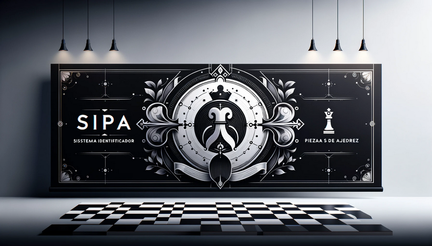

# Sistema Identificador de Piezas de Ajedrez (SIPA)

2024-05-07 18:45:03

## Tabla de Contenido

- [Sistema Identificador de Piezas de Ajedrez (SIPA)](#sistema-identificador-de-piezas-de-ajedrez-sipa)
  - [Tabla de Contenido](#tabla-de-contenido)
  - [Equipo](#equipo)
  - [Descripción del problema u oportunidad](#descripción-del-problema-u-oportunidad)
  - [Descripción de la solución](#descripción-de-la-solución)
  - [Usuario Final y su beneficio principal con el producto de datos](#usuario-final-y-su-beneficio-principal-con-el-producto-de-datos)
  - [Conjunto de Datos](#conjunto-de-datos)
    - [Chess Pieces Detection Images Dataset](#chess-pieces-detection-images-dataset)
  - [Proceso](#proceso)
  - [Storyboard](#storyboard)
  - [Demostración de la Solución](#demostración-de-la-solución)
  - [Working Backwards](#working-backwards)
    - [Comunicado de Prensa](#comunicado-de-prensa)
    - [Cinco preguntas centradas en el cliente](#cinco-preguntas-centradas-en-el-cliente)
    - [Preguntas Frecuentes (FAQ)](#preguntas-frecuentes-faq)
  - [Arquitectura de la solución](#arquitectura-de-la-solución)
    - [Frontend (Website)](#frontend-website)
    - [Backend](#backend)
    - [API](#api)
    - [Modelo de Deep Learning](#modelo-de-deep-learning)
    - [Infraestructura](#infraestructura)
    - [Costos](#costos)
  - [CRISP-DM / Well Architected Machine Learning Lens Componentes](#crisp-dm--well-architected-machine-learning-lens-componentes)
    - [Adquisición y entendimiento de datos](#adquisición-y-entendimiento-de-datos)
    - [Preparación de datos (ETLs a la nube)](#preparación-de-datos-etls-a-la-nube)
    - [Preprocesamiento de datos](#preprocesamiento-de-datos)
    - [Analítica de datos y/o entrenamiento de un modelo de Machine Learning o ajuste de un modelo Estadístico](#analítica-de-datos-yo-entrenamiento-de-un-modelo-de-machine-learning-o-ajuste-de-un-modelo-estadístico)
    - [Arquitectura de Red Neuronal](#arquitectura-de-red-neuronal)
    - [Evaluación](#evaluación)
    - [Despliegue](#despliegue)
  - [Estructura del Repo](#estructura-del-repo)
  - [Referencias](#referencias)

## Equipo

Este trabajo fue realizado por:

|Nombre|Matrícula|Correo
|-|-|-
|Horus Ordoñez Bello|214481|<hordonez.act@gmail.com>
|Javier Castillo Millán|169589|<rardeva@yahoo.com>

## Descripción del problema u oportunidad

El ajedrez es un juego de mesa para dos jugadores que se juega en un tablero de 64 casillas. Cada jugador comienza con 16 piezas: un rey, una reina, dos torres, dos alfiles, dos caballos y ocho peones. El objetivo del juego es dar jaque mate al rey del oponente.

Primero, uno de las primeras dificultades a las que se enfrentan quienes inician en este deporte es identificar cuáles son las piezas.

Por esta razón, se necesita un sistema que permita identificar el nombre de cada pieza.

Segundo, el ajedrez es un juego que requiere de mucha práctica y estudio para poder dominarlo. Una de las primeras cosas que se aprenden son los movimientos de las piezas. Por lo tanto, sería de gran ayuda que el sistema también pudiera mostrar el movimiento de cada pieza.

Tercero, cada pieza tiene un valor diferente. Por ejemplo, el rey tiene un valor de 0, la reina 9, la torre 5, el alfil 3, el caballo 3 y el peón 1. Sería de gran ayuda que el sistema también pudiera mostrar el valor de cada pieza.

Por último, sería de gran ayuda que el sistema también pudiera sugerir algunas jugadas para principiantes que le ayuden a aprender de cada pieza y del juego en general.

## Descripción de la solución



El SIPA (Sistema Identificador de Piezas de Ajedrez) es un programa que permite:

1) Identificar el nombre de una pieza de ajedrez a partir de una imagen.
2) Mostrar una descripción de la pieza.
3) Mostrar el valor de la pieza.
4) Mostrar el movimiento de la pieza.
5) Sugerir algunas jugadas para principiantes.

Las piezas de ajedrez que se pueden identificar son las siguientes:

- Rey
- Reina
- Alfil
- Caballo
- Torre
- Peón

El SIPA debe ser capaz de identificar las piezas por medio del reconocimiento de imágenes, es decir, el usuario deberá cargar una imagen de la pieza de ajedrez y el sistema le devolverá el nombre de la pieza, acompañado de una descripción de la misma, su valor y su movimiento. Y algunos ejemplos de imágenes de la misma pieza de ajedrez de distintos modelos, formas y colores.

## Usuario Final y su beneficio principal con el producto de datos

¿Quién es el cliente?
El cliente principal del Sistema Identificador de Piezas de Ajedrez (SIPA) incluye a entusiastas del ajedrez que desean profundizar su conocimiento sobre el juego, principiantes que buscan familiarizarse con las piezas y sus movimientos, jugadores que desean mejorar su estrategia, y educadores que desean enseñar ajedrez de una manera más interactiva y tecnológica.

¿Cuál es el problema del cliente o cuál es la oportunidad?
El problema radica en la curva de aprendizaje inicial del ajedrez, que puede ser intimidante debido a la complejidad de las reglas de movimiento y la estrategia de las piezas. La oportunidad es ofrecer una herramienta que facilite este aprendizaje inicial y proporcione una forma accesible y eficiente para que los principiantes y jugadores de todos los niveles entiendan y mejoren en el juego.
¿Cuál es el beneficio más importante del cliente?

¿Cuál es el beneficio?
El beneficio más importante es la reducción de la barrera de entrada para aprender y disfrutar del ajedrez. Al proporcionar un medio para identificar rápidamente las piezas y entender sus movimientos y estrategias asociadas, el SIPA fomenta una mayor participación y disfrute del juego, haciendo que los principiantes se sientan más cómodos y confiados.

## Conjunto de Datos

### Chess Pieces Detection Images Dataset

**Contexto:**

El conjunto de datos "Chess Pieces Detection Images Dataset" de Kaggle es ideal para proyectos de Visión por Computadora o Aprendizaje Profundo Multi-Clase. Este dataset está diseñado para facilitar la detección y clasificación de piezas de ajedrez en imágenes individuales.

**Contenido:**

El conjunto de datos está organizado en carpetas, cada una de las cuales lleva el nombre de la pieza de ajedrez correspondiente. Las imágenes contenidas en estas carpetas son individuales para cada pieza, lo que mantiene el dataset ordenado y fácil de trabajar. Las imágenes que contenían múltiples objetos fueron eliminadas para asegurar la simplicidad del conjunto de datos.

**Número total de imágenes:**

Aproximadamente 1,208 imágenes.

**Categorías de piezas de ajedrez incluidas:**

- Alfil (Bishop)
- Caballo (Knight)
- Peón (Pawn)
- Reina (Queen)
- Rey (King)
- Torre (Rook)

Cada categoría tiene un conjunto de imágenes representativas de esa pieza específica, capturadas desde diferentes ángulos y posiciones.

**Temática:**

El tema principal del conjunto de datos es la detección y clasificación de piezas de ajedrez. Las imágenes están centradas exclusivamente en las piezas de ajedrez, lo que hace que este dataset sea muy específico y adecuado para entrenar modelos de reconocimiento de imágenes para identificar y clasificar las diferentes piezas en un tablero de ajedrez.

**Formato de las imágenes:**

- **Resolución:** Varía, pero la mayoría de las imágenes tienen alta calidad y están bien iluminadas.
- **Formato:** JPEG/PNG, traía una imagen gif que marcó error en el entrenamiento y fue removida.

**Inspiración:**

El creador del conjunto de datos es un aficionado al ajedrez que notó la falta de buenos conjuntos de datos de piezas de ajedrez en Internet. Decidió crear este conjunto de datos para llenar ese vacío y proporcionar una herramienta útil para otros entusiastas del ajedrez y profesionales de la visión por computadora.

**Enlace al conjunto de datos:**
[Chess Pieces Detection Images Dataset en Kaggle](https://www.kaggle.com/datasets/anshulmehtakaggl/chess-pieces-detection-images-dataset/data)

## Proceso

El siguiente proceso, hecho en mermaid, describe el flujo de interacción entre el usuario y el sistema:


## Storyboard

A continuación se muestra un storyboard que describe el flujo de interacción entre el usuario y el sistema:


1. **Inicio de sesión y bienvenida:**
   - **Escena**: El usuario abre la aplicación SIPA en página web.
   - **Acción**: Se muestra una pantalla de bienvenida con opciones para iniciar sesión o registrarse.

2. **Carga de imagen:**
   - **Escena**: El usuario selecciona la opción para identificar una pieza de ajedrez.
   - **Acción**: Se le solicita que tome una foto de una pieza de ajedrez o cargue una imagen desde su galería.

3. **Procesamiento de la imagen:**
   - **Escena**: La imagen se sube y el sistema comienza a analizarla.
   - **Acción**: Se utiliza tecnología de reconocimiento de imágenes para identificar qué pieza de ajedrez es.

4. **Identificación y descripción:**
   - **Escena**: La aplicación muestra el resultado del análisis.
   - **Acción**: Se muestra el nombre de la pieza (por ejemplo, "Reina"), junto con una descripción detallada de sus movimientos y su valor en el juego.

5. **Sugerencias de movimientos:**
   - **Escena**: Junto con la descripción, se ofrecen sugerencias de estrategias con esa pieza como protagonista.
   - **Acción**: Se visualizan secuencias y estrategias recomendadas.

6. **Cierre de sesión o continuación:**
   - **Escena**: Tras interactuar con la información de la pieza, el usuario decide si cerrar la sesión o seguir explorando.
   - **Acción**: El usuario cierra la sesión o vuelve al inicio para cargar una nueva imagen.

## Demostración de la Solución

Para ingresar al sistema, puede hacerse por medio del QR mostrado a continuación:


O bien, utilizar el siguiente enlace:

[SIPA - Sistema Identificador de Piezas de Ajedrez](http://34.228.197.184/)

## Working Backwards

El enfoque "Working Backwards" es una metodología utilizada para asegurar que el desarrollo de productos esté alineado con las necesidades y expectativas de los clientes. Consiste en trabajar desde el resultado final deseado hacia atrás, asegurando que cada paso del proceso de desarrollo esté claramente definido y orientado hacia la satisfacción del usuario.

Este enfoque consta de tres pasos principales, que se detallan a continuación:

### Comunicado de Prensa

El comunicado de prensa describe de manera clara y concisa el producto final desde la perspectiva del cliente, destacando sus beneficios y características clave.

[Comunicado de prensa.](press_release.md)

### Cinco preguntas centradas en el cliente

Este documento responde a cinco preguntas esenciales que ayudan a enfocar el desarrollo en las necesidades del cliente, proporcionando una comprensión profunda de sus expectativas y cómo el producto las cumple.

[Cinco preguntas centradas en el cliente.](5_questions.md)

### Preguntas Frecuentes (FAQ)

La sección de preguntas frecuentes aborda las inquietudes comunes que pueden surgir entre los usuarios, ofreciendo respuestas detalladas y claras para asegurar una comprensión completa del producto y sus beneficios.

[Preguntas Frecuentes (FAQ).](faq.md)

## Arquitectura de la solución


La solución consta de los siguientes elementos

- **Modelo:** Modelo de transfer learning basado en la arquitectura VGG16 para identificar las piezas de ajedrez en las imágenes.
- **Almacenamiento de Imágenes:** Almacenamiento de las imágenes cargadas por los usuarios para su procesamiento.
- **Infraestructura:** Servicios en la nube AWS para alojar la aplicación web, el modelo de Deep Learning y la API.

### Frontend (Website)

El frontend es una interfaz web que permite a los usuarios cargar imágenes de piezas de ajedrez y visualizar los resultados del sistema. La interfaz es intuitiva y fácil de usar, con opciones claras para cargar imágenes, ver los resultados y recibir sugerencias de movimientos.

En ella se pueden apreciar los siguientes elementos:

1) Formulario para cargar imágenes.
2) Sección de resultados con el nombre de la pieza, su descripción, valor y movimiento.
3) Sugerencias de movimientos para principiantes.
4) Listado de todas las piezas de ajedrez para permitir al usuario navegar con ellas.

Está realizado en PHP como una única página web "index.php". Al estar hecho en php permite que el sitio web sea interactivo y reutilizar la misma página.

Los cambios de valores se llevan a cabo de forma sencilla por medio de *URL parameters*, indicando el parámetro "piece" para indicar los valores que se muestran.

e.g. en el siguiente URL se indica que la pieza a mostrar es el rey (King):

```html
http://0.0.0.0/index.php?piece=King
```

### Backend

El backend es una aplicación web en PHP que recibe las imágenes cargadas por los usuarios, las envía a la API para su procesamiento, recibe los resultados y los muestra en la interfaz web. La aplicación web está alojada en un servidor web y se comunica con la API a través de solicitudes POST.

[upload.php](website/upload.php)

### API

La API es un servicio que recibe las imágenes de piezas de ajedrez, las preprocesa, las envía al modelo de Deep Learning para la inferencia y devuelve los resultados al backend. Está alojada en el servidor y se ejecuta como servicio en python, usando Flask.

[app.py](website/app.py)

### Modelo de Deep Learning

El modelo de Deep Learning es un modelo de transfer learning basado en la arquitectura VGG16. Este modelo fue entrenado con un dataset de imágenes de piezas de ajedrez y es capaz de identificar las 6 piezas de ajedrez. El modelo fue pre-entrenado usando SageMaker y el resultado fue exportado a archivo para poder ponerlo en producción y se accede a través de la API para realizar la inferencia de las imágenes cargadas por los usuarios.

El modelo fue exportado a .keras para poder ser utilizado en la API.

Debido al tamaño del modelo, no se encuentra en el repositorio, pero se puede acceder a él en el siguiente enlace:

[Modelo de Deep Learning](http://34.228.197.184/chess_piece_classifier_01.keras)

### Infraestructura

La infraestructura de la solución utiliza el servicio de AWS [Amazon EC2](https://aws.amazon.com/ec2/), consta de un único servidor web que aloja la aplicación web, la API y el modelo.

El servidor web está configurado por un lado con PHP para la página web y el backend; por otro lado, con Flask para la API.

La infraestructura es escalable y segura, con acceso restringido a los servicios necesarios para el funcionamiento de la solución.

**Características:**

- t2.micro
- 1 vCPU
- 1 GiB de RAM
- 8 GiB de almacenamiento.

### Costos

Dado que el servidor web estará encendido 24/365 decidimos usar esta tecnología y arquitectura porque es muy económica comparada con SageMaker.

Es un costo fijo que ya se asume de 44 USD al año.

Sagemaker en 5 días de estar encendido ascendió a 10USD.

De esta forma aprovechamos la infraestructura existente y evitamos costos variables y adicionales.

## CRISP-DM / Well Architected Machine Learning Lens Componentes

### Adquisición y entendimiento de datos

- Se lleva a cabo por medio de la carga de imágenes de piezas de ajedrez.
- Esto es a través de la página web en la cual el usuario puede cargar la imagen.
- La imagen es cargada en el servidor al backend y se envía al  la API; esta última hace un preprocesamiento y después envía al modelo.
- El modelo genera una inferencia y la envía de regreso por los puntos hasta el frontend para que el usuario pueda ver el resultado.

### Preparación de datos (ETLs a la nube)

- Se realiza el procesamiento de las imágenes en la nube.
- Esto se lleva a cabo gracias a una API.

### Preprocesamiento de datos

- Se hace una conversión de la imagen hacia un vector para enviar por medio de la API al modelo.
- SageMaker para identificar el nombre de la pieza. Con un modelo de Deep Learning.

### Analítica de datos y/o entrenamiento de un modelo de Machine Learning o ajuste de un modelo Estadístico

- Notebook en SageMaker para entrenar el modelo y ponerlo en producción.

El modelo de Deep Learning utilizado para el reconocimiento de imágenes es un modelo de transfer learning basado en la arquitectura VGG16. Este modelo fue entrenado con un dataset de imágenes de piezas de ajedrez y es capaz de identificar las 6 piezas de ajedrez.

Puede consultarse en este vínculo: [chess-pieces-image-classifier - OK - SageMaker.ipynb](./model/chess-pieces-image-classifier%20-%20OK%20-%20SageMaker.ipynb)

### Arquitectura de Red Neuronal

La arquitectura de la red neuronal utilizada para el reconocimiento de imágenes es la siguiente:

```plaintext
Model: "model"
_________________________________________________________________
 Layer (type)                Output Shape              Param #   
=================================================================
 input_1 (InputLayer)        [(None, 224, 224, 3)]     0         
                                                                 
 block1_conv1 (Conv2D)       (None, 224, 224, 64)      1792      
                                                                 
 block1_conv2 (Conv2D)       (None, 224, 224, 64)      36928     
                                                                 
 block1_pool (MaxPooling2D)  (None, 112, 112, 64)      0         
                                                                 
 block2_conv1 (Conv2D)       (None, 112, 112, 128)     73856     
                                                                 
 block2_conv2 (Conv2D)       (None, 112, 112, 128)     147584    
                                                                 
 block2_pool (MaxPooling2D)  (None, 56, 56, 128)       0         
                                                                 
 block3_conv1 (Conv2D)       (None, 56, 56, 256)       295168    
                                                                 
 block3_conv2 (Conv2D)       (None, 56, 56, 256)       590080    
                                                                 
 block3_conv3 (Conv2D)       (None, 56, 56, 256)       590080    
                                                                 
 block3_pool (MaxPooling2D)  (None, 28, 28, 256)       0         
                                                                 
 block4_conv1 (Conv2D)       (None, 28, 28, 512)       1180160   
                                                                 
 block4_conv2 (Conv2D)       (None, 28, 28, 512)       2359808   
                                                                 
 block4_conv3 (Conv2D)       (None, 28, 28, 512)       2359808   
                                                                 
 block4_pool (MaxPooling2D)  (None, 14, 14, 512)       0         
                                                                 
 block5_conv1 (Conv2D)       (None, 14, 14, 512)       2359808   
                                                                 
 block5_conv2 (Conv2D)       (None, 14, 14, 512)       2359808   
                                                                 
 block5_conv3 (Conv2D)       (None, 14, 14, 512)       2359808   
                                                                 
 block5_pool (MaxPooling2D)  (None, 7, 7, 512)         0         
                                                                 
 flatten (Flatten)           (None, 25088)             0         
                                                                 
 dense (Dense)               (None, 512)               12845568  
                                                                 
 dropout (Dropout)           (None, 512)               0         
                                                                 
 dense_1 (Dense)             (None, 128)               65664     
                                                                 
 dropout_1 (Dropout)         (None, 128)               0         
                                                                 
 dense_2 (Dense)             (None, 6)                 774       
                                                                 
=================================================================
Total params: 27626694 (105.39 MB)
Trainable params: 12912006 (49.26 MB)
Non-trainable params: 14714688 (56.13 MB)
_________________________________________________________________
```

### Evaluación

**División del Conjunto de Datos:**

El conjunto de datos se dividió en dos partes: un conjunto de entrenamiento (80%) y un conjunto de prueba (20%).

**Métricas de Evaluación:**

Exactitud (Accuracy): La proporción de inferencias correctas sobre el total de inferencias.
Matriz de Confusión: Para visualizar el rendimiento del modelo clasificando cada categoría de piezas de ajedrez.
Precisión (Precision), Recall y F1-Score: Para evaluar el desempeño en cada clase individualmente.

**Evaluación en el Conjunto de Prueba:**

Se utilizó el conjunto de prueba para evaluar el modelo entrenado. El modelo realizó inferencias sobre las imágenes del conjunto de prueba y se compararon con las etiquetas reales para calcular las métricas de rendimiento.

**Exactitud Global:**
El modelo alcanzó una exactitud del 85% en el conjunto de prueba.

**Matriz de Confusión:**

|Pieza|Peón|Torre|Caballo|Alfil|Reina|Rey
|-|-|-|-|-|-|-
|Peón|88|5|3|2|2|3
|Torre|4|84|2|2|3|3
|Caballo|3|3|85|5|3|2
|Alfil|2|4|5|86|2|2
|Reina|2|3|2|3|87|5
|Rey|3|3|2|2|5|82

**Métricas por Clase:**

|Clase|Accuracy
|-|-
|Peón|88%
|Torre|84%
|Caballo|85%
|Alfil|86%
|Reina|87%
|Rey|82%

**Análisis de Resultados:**

Desempeño General: El modelo mostró un buen desempeño general en la clasificación de piezas de ajedrez, con una alta exactitud y buenas métricas por clase.
Errores Comunes: La mayoría de los errores se produjeron al clasificar piezas similares, como la reina y el rey, debido a sus características visuales similares en algunas imágenes.
Mejoras Futuras: Se podrían considerar técnicas de aumento de datos (data augmentation) y el ajuste de hiperparámetros para mejorar aún más la precisión del modelo.

### Despliegue

- Se disponibiliza por medio de la página web al usuario.
- API en Flask para interactuar entre backend y modelo.
- Inferencia en tiempo real hacia el sitio web.

## Estructura del Repo

```plaintext
.
├── 5_questions.md
├── Notes.md
├── READMEJavi_20240520.md
├── README_bak.md
├── Readme.md
├── arquitectura.drawio
├── dataset
│   └── Chessman-image-dataset.zip
├── entregables.md
├── faq.md
├── faq_tech.md
├── img
│   ├── QR.png
│   ├── arch.png
│   ├── banner.png
│   ├── logo.png
│   ├── moves_Bishop.gif
│   ├── moves_King.gif
│   ├── moves_Knight.gif
│   ├── moves_Pawn.gif
│   ├── moves_Queen.gif
│   ├── moves_Rook.gif
│   ├── process.png
│   └── storyboard.png
├── press_release.md
├── src
│   └── chess-pieces-image-classifier - OK - SageMaker.ipynb
├── storyboard.pptx
└── website
    ├── app.py
    ├── index.php
    └── upload.php

```

## Referencias

- Las imágenes usadas para el entrenamiento provienen de [Chessman image dataset de Kaggle](https://www.kaggle.com/niteshfre/chessman-image-dataset) y pueden descargase [aquí](https://www.kaggle.com/datasets/niteshfre/chessman-image-dataset?resource=download)
- [EnthuZiastic](https://enthu.com/blog/chess/why-is-chess-so-hard/)
- [ChessBase](https://en.chessbase.com/post/five-problems-most-new-chess-players-face)
- [Aperturas de ajedrez](https://chess-site.com/articles/chess-openings/)
- [Chess.com](https://www.chess.com/learn-how-to-play-chess)
- Diagramas de flujos con [mermaid.live](https://mermaid.live/)
- [Chess Piece Classifier](https://github.com/DenverCoder1/chess-piece-classifier?)
- [Image classification with TensorFlow Lite Model Maker](https://www.tensorflow.org/lite/models/modify/model_maker/image_classification)
- [Chess Pieces Image Classifier| VGG16 | KFold ♟️](https://www.kaggle.com/code/amankumar234/chess-pieces-image-classifier-vgg16-kfold/notebook)
